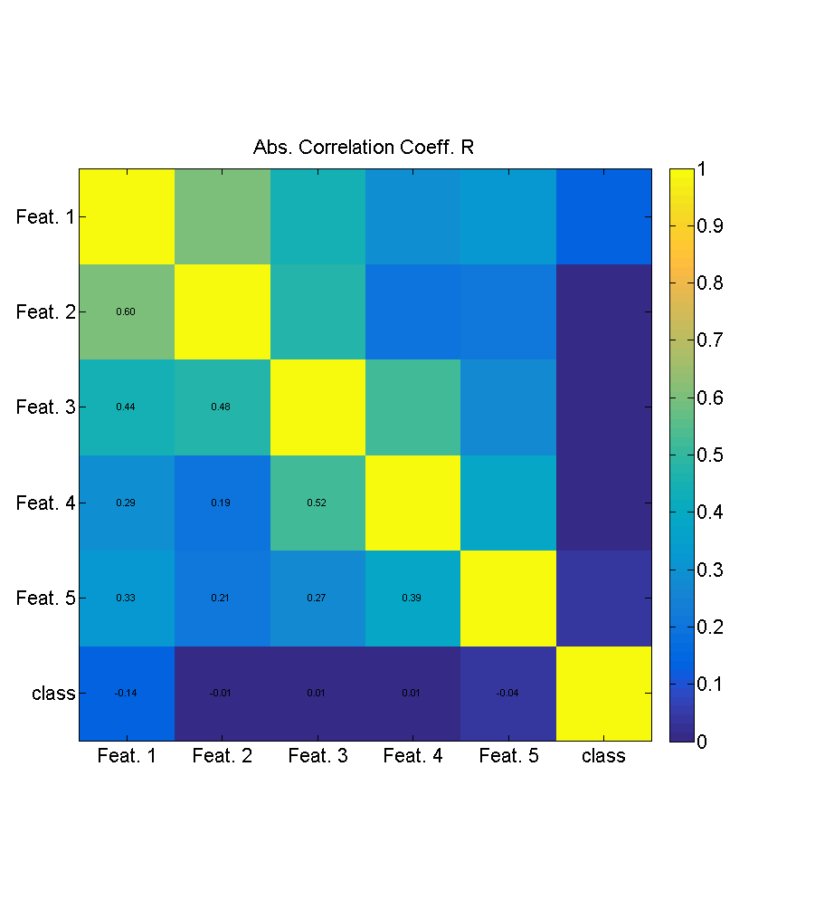
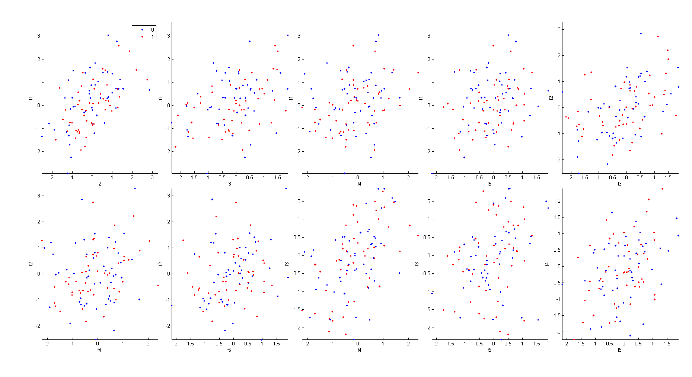
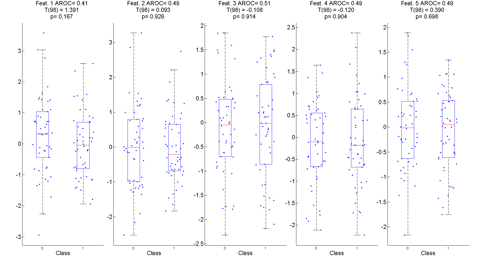
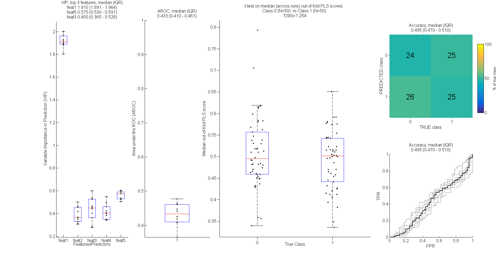
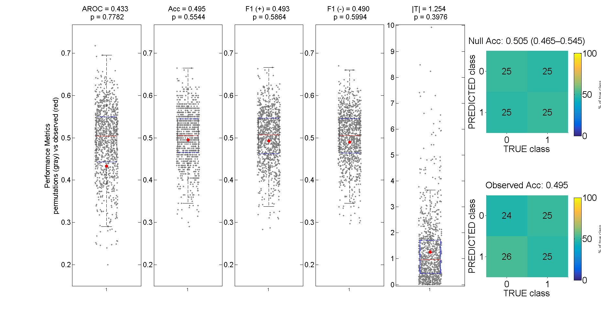

# Pipeline for repeated CV of predictive model (PLS–LDA) 
## From synthetic data generation, to p-values via permutation tests 

This page documents how to **run**, **visualize**, and **interpret** the workflow for the PLS–LDA classifier under **known conditions**, using synthetic data.
The goal is to show *how to use the pipeline* and to verify that it behaves consistently.

**Main Script to run all functions**
- `synthdata_run_prediction`

**Core functions, called step by step by the Main script:**
- `generateSynthCorrelatedData`
- `plotFeaturesClass_univariate`
- `runRepeatedCV_TrainPLSLDA_PredictOutOfFold`
  - `trainModel_PredictTestSet` (iteratively called for each run, in each fold) 
- `plotPLS_CV_Summary`
- `runPermTest_RepCV`
- `plotPermTest_RepCV`

# Work-flow with synthetic data independent from classes (effect=0)

## Data Generation
We will first show that using correlated data and no effect (by construction) the classifier performance will fall at chance level.
Let's begin by setting crucial parameters to generate synthetic data:
- we'll generate some 50 fake observations, for each of the two classes (nPerClass =50)
- each observation will be measured by 5 predictor/feature variables (nFeat =5)
- each neighboring feature will correlate with the next (rho=0.5)
- each will have some degree of noise (sigmaNoise=1)
- these features will have no relation with the class to be predicted (effect=0)

```matlab
 synthetic data generation
%% GENERATE SYNTHETIC DATA
% Controlled synthetic data generator:
% - balanced binary labels
% - optional class effect implemented as a pure mean shift (controlled by effect)
% - correlated Gaussian features with AR(1)/Toeplitz covariance (controlled by rho)
%
% Features are generated with an AR(1)/Toeplitz covariance (Sigma_ij = rho^|i-j|),
% implying strong correlation between adjacent features and exponentially decaying correlation with increasing feature distance.
%  As a consequence, neighboring features carry partially redundant information and feature importance measures (e.g., VIP)
% may be distributed across correlated predictors rather than concentrated on a single feature.
%
% NOTE: With effect = 0, features and labels are independent by construction; therefore, as sample size N tends to ?
%  any consistent classifier will converge to chance-level performance,  while finite-N runs may fluctuate.
%  Permutation test should show that under no effect the behaviour is within chance-level
% ---------------- PARAMETERS FOR SYNTHETIC DATA --------------
synth=[];
synth.randSeed   =   0; %10000 100 randi(1e9);  %    6.7109
synth.nPerClass  = 50;     % samples per class
synth.nFeat      = 5;      % any N > 2 works
synth.sigmaNoise = 1.0;     % overall noise scale
synth.rho        = 0.5;     %   feature correlation (AR(1) Toeplitz),  
synth.effect     = 0;     % class mean separation in units of sigmaNoise (0 => no effect)
% ----------------------------------------------------------------------------
dataSynth = generateSynthCorrelatedData(synth);
```

## Data Inspection
We now inspect the relations across features and with the class

```matlab
%% PLOT FEATURES and CLASS
% Optional diagnostic: inspect class overlap and feature correlations before running the classifier
 plotFeaturesClass_univariate(dataSynth.feats, dataSynth.class, dataSynth.featName)
```

## Figures N1 — Synthetic feature diagnostics (`plotFeaturesClass_univariate`)
### N1a: Bivariate feature pairs


**What it shows:** correlated predictors (geometry / covariance) without class structure.  
**Interpretation (null):** correlated elliptical clouds are expected; classes should appear intermingled across all projections.

### N1b: Absolute correlation matrix (features + class)


**What it shows:** feature–feature correlation and feature–class associations.  
**Interpretation (null):** feature–feature correlations reflect the intended dependency; feature–class correlations should remain near zero (allowing finite-sample fluctuations).

### N1c: Univariate feature contrast by class (AROC / T / p)


**What it shows:** univariate separability of each feature.  
**Interpretation (null):** AROC values should be near 0.5 and t-tests non-significant; deviations are expected occasionally due to finite N, but should not be systematic across features or seeds.

---

## Predict within repeated stratified Cross-Validation 
We now combine these features into a predictive model (Partial Least Square with LDA binary classification)
which is tested with resamplings, specifically across 10 runs of k-fold Cross-Validation (k=10).
The results are then plotted

```matlab
%%  PREDICTION WITH RESAMPLINGS + PLOT
% % % % % % % % %%%%%%%%%%%%%%%%%%%%%%%%%%%%
% CORE: repeated, stratified K-fold CV producing strictly out-of-fold predictions.
% In each fold, the model is fit on TRAIN only, with a PLS +LDA strategy:
% a predictive PLS1 model (Partial Least Square with 1 component, PLS) leads to continuous PLS scores 
% and a 1D diag-linear Linear Discriminant Analysis classifier binarizes scores (trained on TRAIN data only),
% with optional subject-wise leakage control (exclude from TRAIN any subject appearing in TEST)
% and z-scoring computed from TRAIN statistics only.
% Out-of-fold scores/predictions are stored in the original sample coordinates and then aggregated across repetitions
% (medians/IQR, median ROC on a fixed FPR grid), yielding a robust observed-performance summary.

% ---------------- PARAMETERS FOR REPEATED CROSS-VALIDATION of prediction + ----------------
cvOpts =[];
cvOpts.numCvReps = 10;
cvOpts.numCvFolds= 10;
cvOpts.avoidTrainOnTestSubj = 1; % subject-wise leakage control (in this example is irrelevant, each subject appears once)
cvOpts.zscoreFromTrain     =1;      % normalize using TRAIN stats only
cvOpts.rngSeed  =    1;   %  seed for CV splits (set fixed for exact reproducibility) or random to change splitting. randi(1e9)

cvOpts.classTypes           = [0 1];    % enforce order
cvOpts.posClass             = 1;
cvOpts.priorType= 'uniform';

% Repeated K-fold cross-validation (CV) for training and evaluating PLS-LDA model:
[cvCombined, cvReps] = runRepeatedCV_TrainPLSLDA_PredictOutOfFold( ...
     dataSynth.feats, dataSynth.class, dataSynth.subjID, cvOpts);

%%%%%%%%%%%%%%%%%%%%%%%%%%%%%%%%%%%%%%
% Plot summary of PLS prediction and LDA classification results across CV repetitions
plsPlot = plotPLS_CV_Summary(cvCombined, cvReps , 'featName', plsPlot.featName);
```

## Figure N2 — Observed repeated-CV performance summary (`pls_cv_summary`)


**Panel-by-panel interpretation (null):**
- **VIP (left):** VIP can look structured in correlated predictors and may even be consistently > 1 for a feature in a given synthetic realization; this reflects covariance structure and finite-sample alignment with random labels, and is **not sufficient evidence of predictive signal**.
- **AROC over repetitions:** should remain around chance.
- **Median out-of-fold PLS scores by class:** should overlap strongly; any separation should not be reproducible across seeds.
- **Confusion matrix (Pred × True):** should be near-balanced; accuracy near 0.5.
- **ROC curves:** should track the diagonal; median ROC close to chance.

---

## SIGNIFICANCE (p-values) VIA PERMUTATION TESTS 
We will now perform multiple shuffling of the data (permutations), and assess the performance with each shuffled dataset, to build an empirical distribution of values that fall under a null effect.
We will count how many instances are above the chance level, and (given in this case we have no effect by construction) we will expect that the observed effect will fall within the 95% central part of the empirical null distribution, for each of the performance metrics

```matlab
%% SIGNIFICANCE VIA PERMUTATIONS
% assess significance  of observed (real) performance, against empirical null distribution
% i.e. get p values from random permutations
permOpts.nPerm= 1000;
permT = runPermTest_RepCV( dataSynth.feats, dataSynth.class, dataSynth.subjID,  cvOpts, cvCombined, permOpts);


%% PLOT REAL vs NULL (PERMUTATION) RESULTS
% plot comparison of observed (real) performance vs distribution of null results from permutations
plt = plotPermTest_RepCV(permT, cvCombined);

```

## Figure N3 — Permutation test (observed vs null) (`plotPermTest_RepCV`)


**What it shows:** empirical null distributions vs observed performance.  
**Interpretation (null):** observed metrics should lie well within the permutation distributions (non-significant p-values), and observed confusion matrices should be similar to the null mean—supporting correct calibration of the workflow.
**Overall (effect=0):** correlated predictors can yield structured VIP patterns, but out-of-fold metrics and permutation tests remain consistent with chance.  
This figure tests whether the observed classifier performance differs from what is expected by chance, given the same full pipeline (CV, normalization, leakage control), using label permutations.

(A) AROC: observed value lies within the null distribution.  
(B) Accuracy: consistent with chance-level prediction.  
(C) F1 (positive class): no class-specific advantage over null.  
(D) F1 (negative class): symmetric errors across classes.  
(E) |T| of out-of-fold PLS scores: no systematic score separation.  
(F) Null mean confusion matrix: expected chance-level baseline.  
(G) Observed confusion matrix: closely matches the null mean

---

